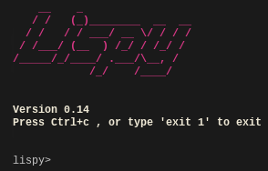

Byol
====
Build your own Lisp.

About
=====
This is just a small pet project following the fantastic tutorial @ [Build your own Lisp](http://www.buildyourownlisp.com)

Docker
======
Now with a docker automated build. See [the registry](https://registry.hub.docker.com/u/plastboks/byol/) for details.

Status
======
Currently the code is at chapter 15. `src/lispy.c` is the main and only source file used for all chapters.

Compilation and running
=======================
* run: `make`
* run: `./lispy`
