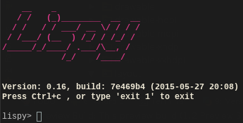

Byol
====
Build your own Lisp.

About
=====
This is just a small pet project following the fantastic tutorial @ [Build your own Lisp](http://www.buildyourownlisp.com)

Docker
======
Now with a docker automated build. See [the registry](https://registry.hub.docker.com/u/plastboks/byol/) for details.
* change directory into `./docker`
* run: `build` (need superuser)
* run: `run` (need superuser)

Compilation and running
=======================
* run: `make`
* run: `make install` (needs superuser)
* run: `./bin/lispy`

Thanks to
=========
* Daniel Holden for making [this](http://www.buildyourownlisp.com/) fantastic tutorial. Code [here](https://github.com/orangeduck/BuildYourOwnLisp)
* Salvatore Sanfilippo for making his snappy [readline alternative](https://github.com/antirez/linenoise)
