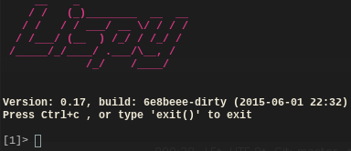

Lispy
====
Build your own Lisp.



About
=====
This is just a small pet project following the fantastic tutorial @ [Build your own Lisp](http://www.buildyourownlisp.com)

Docker
======
Now with a docker automated build. See [the registry](https://registry.hub.docker.com/u/plastboks/lispy/) for details.
* change directory into `./docker`
* run: `build` (need superuser)
* run: `run` (need superuser)

Compilation and running
=======================
* run: `make`
* run: `make install` (needs superuser)
* run: `./bin/lispy` or `lispy`

Movement keys (optional)
========================
* ctrl-a: Go to start of line.
* ctrl-e: Go to end of line.
* ctrl-w: Delete previous word.
* ctrl-u: Delete whole line
* ctrl-b: Move cursor left
* ctrl-f: Move cursor right
* ctrl-p: Previous history entry in-line
* ctrl-n: Next history entry in-line

Standard library
================
The standard library is loaded by default. The other libraries have to be loaded manually, or through the environmental settings file.

Environment settings
====================
Settings should be stored in LISPY_DEFAULT environment for automatic load on startup.

```bash
cp defaults.lspy.example ~/.defaults.lispy
export LISPY_DEFAULT=~/.defaults.lispy
```

Thanks to
=========
* Daniel Holden for making [this](http://www.buildyourownlisp.com/) fantastic tutorial. Code [here](https://github.com/orangeduck/BuildYourOwnLisp)
* Salvatore Sanfilippo for making his snappy [readline alternative](https://github.com/antirez/linenoise)
